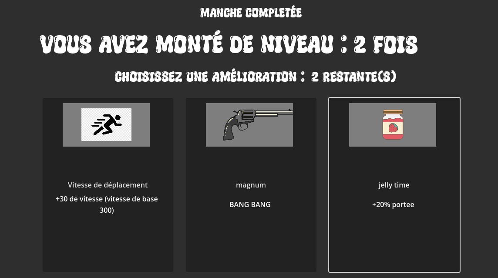
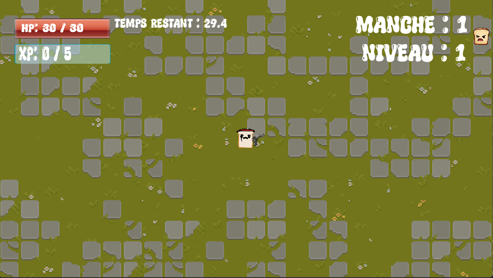

# Presentation Eye of the toaster
    -Louis-Philippe L'Ecuyer

Eye of the Toaster est un jeu de survie roguelite progressif dans lequel les ennemis ainsi que le joueur peuvent croître de manière exponentielle. Chaque ennemi vaincu accorde des EXP, qui permettent au joueur de monter en niveau. Pour chaque niveau gagné durant une partie, le joueur peut sélectionner une autre amélioration. L'objectif est très clair : essayer de rester en vie le plus longtemps possible sans mourir.

Ce projet a été inspiré principalement par le jeu Brotato, qui a également été réalisé en utilisant GDScript. L'idée même de contrôler plusieurs armes en même temps provient directement de ce jeu. L'objectif que je souhaite atteindre est de créer ma propre version unique de Brotato tout en restant fidèle aux mécaniques et au design originaux mais dans des délais contraints.

## Systeme D'amelioration

Comme dans Brotato, Eye of the Toaster propose des améliorations aléatoires basées sur un système de rareté. Ces améliorations peuvent être de simples bonus de statistiques ou l'acquisition de nouvelles armes, permettant de mieux équiper le personnage pour affronter les vagues d'ennemis.

Pour implémenter cela, j'ai conçu un gestionnaire d'améliorations, qui génère un tableau d'objets de classe "Upgrade". Chaque amélioration possède ses propres caractéristiques et une rareté définie (allant de 1 à 7). La classe "Upgrade" inclut une méthode appliquer, qui modifie les statistiques du joueur via un Callable associé à l'amélioration spécifique.

Dans le menu d'amélioration, le tableau d'améliorations est mélangé en fonction de leur rareté. J'utilise la fonction intégrée de Godot max() pour comparer les valeurs, ce qui réduit la probabilité de voir apparaître des améliorations rares. Ensuite, ces améliorations sont ajoutées à un tableau, mélangées, puis seules les trois premières sont affichées au joueur.

    J'ai trouver cette technique en fouillant la doc officiele de godot 

    https://docs.godotengine.org/en/stable/classes/class_array.html
 

## Generation procedurale

Eye of the Toaster propose une carte générée procéduralement, bien que son impact soit principalement visuel. Inspiré de jeux comme Vampire Survivors, j'ai voulu une carte suffisamment vaste pour que le joueur puisse s'y déplacer presque infiniment sans rencontrer de limites. Pour des raisons 

En utilisant un TileMap et le bruit de Perlin, chaque tuile est placée aléatoirement, créant une carte à l'apparence naturelle, différente à chaque partie grâce à une seed générée aléatoirement.

Pour chaque tuile de gazon, une texture est sélectionnée au hasard dans un atlas, tandis qu'une autre technique est appliquée pour les dalles. Cela donne un environnement vivant et renouvelé à chaque nouvelle partie.

    pour cet algorithme, je me suis aidé de cette source 
    https://www.youtube.com/watch?v=rlUzizExe2Q
